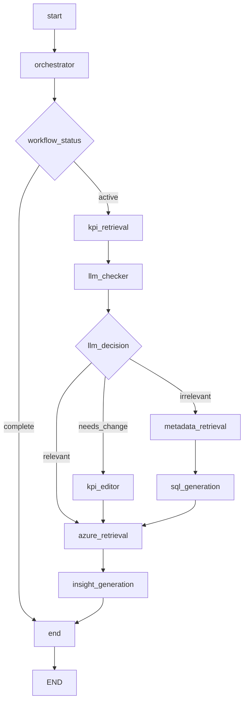

# Hirschbach Risk Intelligence Graph Flow

## Complete Data Retrieval Flow

## Flow Description

1. **Start** → **Orchestrator**: Initializes conversation
2. **Orchestrator Decision**:
   - Direct reply → End (simple questions)
   - Data retrieval → KPI Retrieval (complex data questions)

3. **KPI Retrieval** → **LLM Checker**: Retrieves KPIs and validates them

4. **LLM Checker Decision**:
   - **Relevant**: KPI is good → Azure Retrieval
   - **Needs Change**: KPI needs editing → KPI Editor → Azure Retrieval  
   - **Irrelevant**: KPI not useful → Metadata Retrieval → SQL Generation → Azure Retrieval

5. **Azure Retrieval** → **Insight Generation** → **End**: Final data processing and response

## Key Features

- **Conditional Routing**: Smart decisions at each step
- **Sequential Processing**: Each path leads to data retrieval
- **State Management**: All data passed through state
- **Error Handling**: Graceful fallbacks at each step
